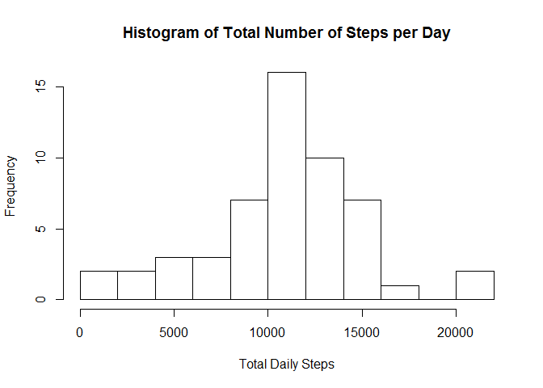
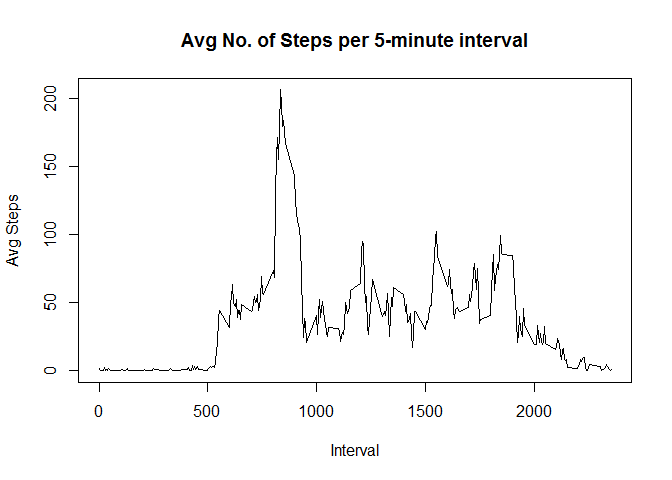
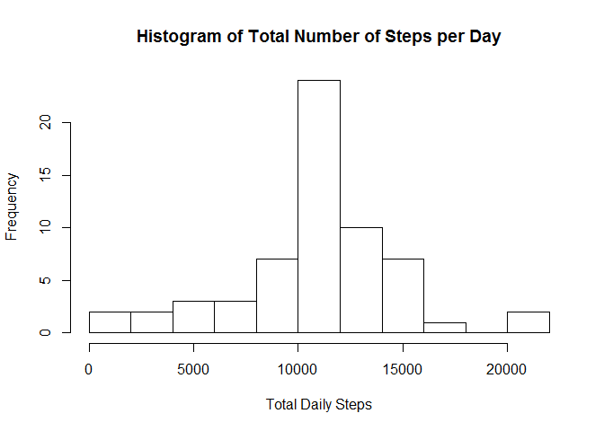
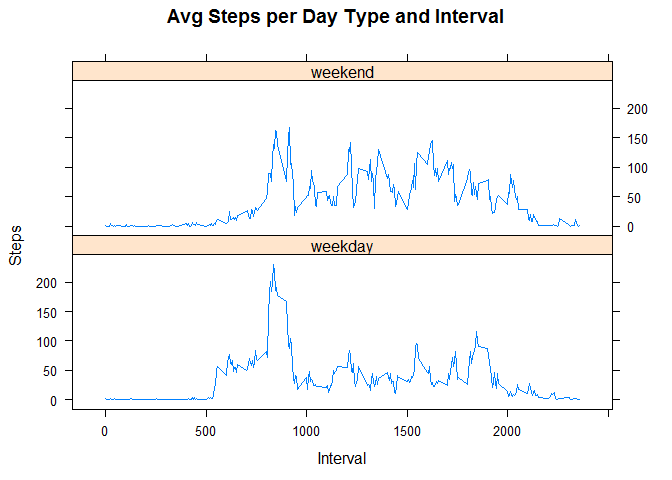

# Reproducible Research Assignment 1
This assignment is the first one of the Coursera Course "Reproducible Research". 

[Link to the original Assignment Desription on Github](http://github.com/rdpeng/RepData_PeerAssessment1)


#1. Loading and preprocessing the data

### 1.1 Load the data 

```r
activity_data <- read.csv("C:/Users/Robert/Documents/Coursera_Reproducible_Research/activity.csv", header = TRUE)
```

### 1.2 Process/transform the data into a format suitable for your analysis

```r
#parse date column as date
activity_data$date <- as.Date(activity_data$date)

#Remove rows with NA values
analysis_data <- activity_data[complete.cases(activity_data),]
```


#2. What is mean total number of steps taken per day?

### 2.1 The total number of steps taken per day

```r
#Sum of steps by day
daily_steps <- tapply(analysis_data$steps,analysis_data$date,sum)
daily_steps_df <- as.data.frame(cbind(names(daily_steps),as.numeric(daily_steps))) 
names(daily_steps_df) <- c("date","total_steps")
daily_steps_df$date <- as.Date(daily_steps_df$date)
daily_steps_df$total_steps <-  as.numeric(as.character(daily_steps_df$total_steps))
head(daily_steps_df)
```

```
##         date total_steps
## 1 2012-10-02         126
## 2 2012-10-03       11352
## 3 2012-10-04       12116
## 4 2012-10-05       13294
## 5 2012-10-06       15420
## 6 2012-10-07       11015
```

### 2.2 Histogram of the total number of steps taken each day

```r
#Histogram
hist(daily_steps_df$total_steps, main = "Histogram of Total Number of Steps per Day", xlab = "Total Daily Steps", breaks = 12)
```



### 2.3 The mean and median of the total number of steps taken per day

```r
#Mean
mean(daily_steps_df$total_steps)
```

```
## [1] 10766.19
```

```r
#Median
median(daily_steps_df$total_steps)
```

```
## [1] 10765
```


# 3. What is the average daily activity pattern?

### 3.1 The average number of steps taken per 5-minute interval

```r
#Mean of steps by interval
mean_steps <- tapply(analysis_data$steps,analysis_data$interval,mean)
mean_steps_df <- as.data.frame(cbind(names(mean_steps),as.numeric(mean_steps))) 
names(mean_steps_df) <- c("interval","mean_steps")
mean_steps_df$interval <- as.character(mean_steps_df$interval)
mean_steps_df$mean_steps <-  as.numeric(as.character(mean_steps_df$mean_steps))
plot(mean_steps_df, type = "l", main = "Avg No. of Steps per 5-minute interval", xlab = "Interval", ylab = "Avg Steps")
```



### 3.2 Which 5-minute interval contains the maximum number of steps?


```r
#Interval with highest number of steps, on average
max_loc <- which(mean_steps_df$mean_steps == max(mean_steps_df$mean_steps))
mean_steps_df$interval[max_loc]
```

```
## [1] "835"
```

# 4. Imputing missing values

Note that there are a number of days/intervals where there are missing values (coded as NA). The presence of missing days may introduce bias into some calculations or summaries of the data.

### 4.1 The total number of missing values in the dataset

```r
#Number of rows with NA values
sum(is.na(activity_data))
```

```
## [1] 2304
```


### 4.2 Filling in all of the missing values in the dataset with the rounded mean for that 5-minute interval

```r
#Impute NA values

# locate missing values
mval <- which(is.na(activity_data))

activity_data_imp <- activity_data # copy dataframe

#replace na values with mean for 5 minute interval
for (i in mval){
  int <- activity_data[i,3] #find interval for missing value
  int_mean_rnd <- round(mean_steps_df[mean_steps_df$interval == int,2],0) #find mean interval and round it
  activity_data_imp[i,1] <- int_mean_rnd
} 
```

### 4.3 New dataset that is equal to the original dataset but with the missing data filled in.

```r
#Old Dataset
head(activity_data)
```

```
##   steps       date interval
## 1    NA 2012-10-01        0
## 2    NA 2012-10-01        5
## 3    NA 2012-10-01       10
## 4    NA 2012-10-01       15
## 5    NA 2012-10-01       20
## 6    NA 2012-10-01       25
```

```r
#New Dataset with imputed values
head(activity_data_imp)
```

```
##   steps       date interval
## 1     2 2012-10-01        0
## 2     0 2012-10-01        5
## 3     0 2012-10-01       10
## 4     0 2012-10-01       15
## 5     0 2012-10-01       20
## 6     2 2012-10-01       25
```

### 4.4 Histogram of the total number of steps taken each day

```r
#Sum of steps by day
daily_steps2 <- tapply(activity_data_imp$steps,activity_data_imp$date,sum)
daily_steps_df2 <- as.data.frame(cbind(names(daily_steps2),as.numeric(daily_steps2))) 
names(daily_steps_df2) <- c("date","total_steps")
daily_steps_df2$date <- as.Date(daily_steps_df2$date)
daily_steps_df2$total_steps <-  as.numeric(as.character(daily_steps_df2$total_steps))
#Histogram with Imputed values
hist(daily_steps_df2$total_steps, main = "Histogram of Total Number of Steps per Day", xlab = "Total Daily Steps", breaks = 12)
```




### 4.5 The mean and median total number of steps taken per day. How do these values differ from the estimates from the first part of the assignment?

What is the impact of imputing missing data on the estimates of the total daily number of steps?
 

```r
#Mean
mean(daily_steps_df2$total_steps)
```

```
## [1] 10765.64
```

```r
#Median
median(daily_steps_df2$total_steps)
```

```
## [1] 10762
```

The estimates of the total daily number of steps decreased slightly after imputing the missing data.

# 5. Are there differences in activity patterns between weekdays and weekends?

### 5.1 New factor variable in the dataset with two levels - "weekday" and "weekend"

```r
#Determine day of week
weekday <- weekdays(activity_data_imp$date)

#Determine whether weekday or weekend
activity_data_imp$day_type <- as.factor(ifelse(weekdays(activity_data_imp$date) %in% c("Sonntag","Samstag") == TRUE,"weekend", "weekday"))
str(activity_data_imp)
```

```
## 'data.frame':	17568 obs. of  4 variables:
##  $ steps   : num  2 0 0 0 0 2 1 1 0 1 ...
##  $ date    : Date, format: "2012-10-01" "2012-10-01" ...
##  $ interval: int  0 5 10 15 20 25 30 35 40 45 ...
##  $ day_type: Factor w/ 2 levels "weekday","weekend": 1 1 1 1 1 1 1 1 1 1 ...
```

### 5.2 Average number of steps taken per 5-minute-interval, averaged across all weekday days or weekend days. 

```r
#Avg Steps Taken per Day Type and Interval
library(reshape2)
ac <- melt(activity_data_imp[,-2], id.vars = c("day_type", "interval"))
mean_steps_data <- dcast(ac, day_type + interval ~ variable, mean)

library(lattice)
xyplot(steps~interval|day_type, data=mean_steps_data, type='l', layout=c(1,2),main="Avg Steps per Day Type and Interval", xlab="Interval",ylab="Steps")
```



